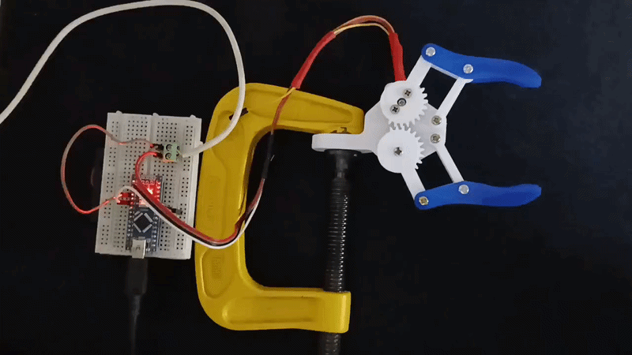
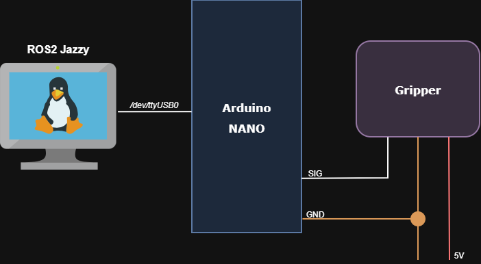

# ROS2 Gripper Controller

A ROS2 package for controlling a gripper via serial communication with an Arduino Nano.

## Overview

This project provides a ROS2 node that communicates with an Arduino microcontroller to control a gripper servo. Commands are sent via ROS2 message topics and forwarded to the Arduino over serial communication.



## Hardware Requirements

- Arduino microcontroller (or compatible board)
- Servo motor
- USB-to-Serial adapter (if using serial port)
- Gripper mechanism



## Installation

### Prerequisites

- ROS2 installed (tested with ROS2 Jazzy )
- Ubuntu 24.04
- C++ compiler with C++17 support
- Arduino IDE or build tools (for uploading firmware)

### Build

```bash
cd ~/ros2_gripper
colcon build --packages-select gripper_controller
```

### Source Setup

```bash
source install/setup.bash
```

## Usage

### Running the Node

```bash
ros2 run gripper_controller gripper --ros-args -p port:=/dev/ttyUSB0
```

### Publishing Commands

Send commands to the gripper:

```bash
# Open gripper
ros2 topic pub --once /gripper/state std_msgs/msg/String "data: 'open'"

# Close gripper
ros2 topic pub --once /gripper/state std_msgs/msg/String "data: 'close'"

# See the data being published
ros2 topic echo /gripper/state
```

## Topics

- **Subscribed:** `/gripper/state` (std_msgs/String) - Command messages for the servo

## Configuration

The node supports the following parameters:
- `port` (string, default: `/dev/ttyUSB0`) - Serial port for Arduino communication